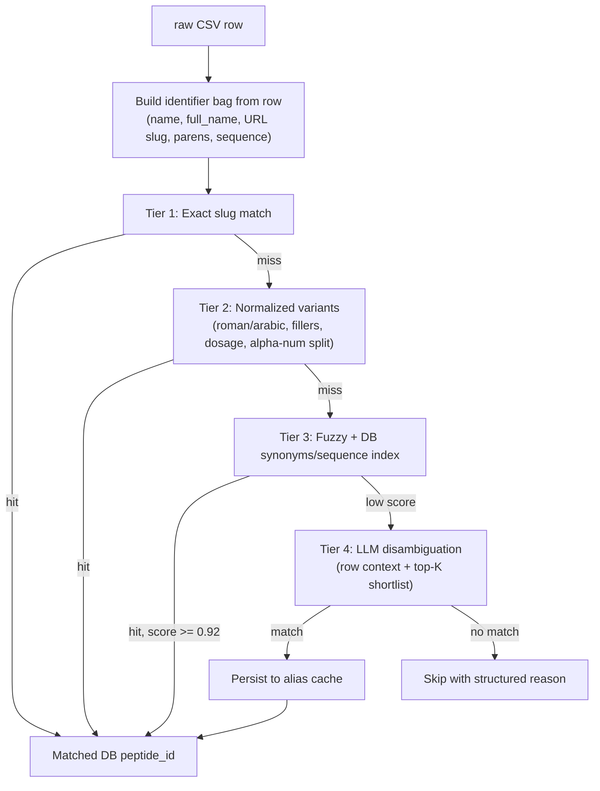

# Peptide Name Normalization Fix

## 1. Problem recap

Today's matcher in [src/utils/peptide_utils.py](src/utils/peptide_utils.py) only uses `Peptide_Name` from the CSV and `slug` + `LOWER(name)` from the DB ([src/infrastructure/db/repositories/peptide.py](src/infrastructure/db/repositories/peptide.py) lines 17-27). It misses on abbreviation vs full name (`DSIP` vs `Delta Sleep-Inducing Peptide`), punctuation (`BPC157` vs `bpc-157`), roman vs arabic (`Melanotan II` vs `melanotan-2`), unstripped fillers (`w/ DAC`, `Injectable`), dosage suffixes (`Semaglutide 5mg`), brand aliases (`(Ozempic)`), and combos (`Hexarelin / Examorelin`). It also has a slug-only lookup bug downstream: an identifier can match via `name_lower` but `db.get_peptide_by_slug()` ([src/infrastructure/db/repositories/peptide.py](src/infrastructure/db/repositories/peptide.py) line 9) then fails.

## 2. Target architecture: 4-tier resolver



Every tier writes which tier resolved the row into the existing summary so you can see drift over time.

## 3. Concrete changes per file

### 3.1 Expand the CSV-side identifier bag

New module `src/utils/peptide_identifier_bag.py`:

```python
def build_identifier_bag(row: dict) -> dict:
    return {
        "name":        row.get("Peptide_Name", "").strip(),
        "full_name":   row.get("Full_Name", "").strip(),
        "url_slug":    extract_slug_from_url(row.get("URL", "")),
        "sequence":    row.get("molecular_information_amino_acid_sequence", "").strip(),
        "overview":    first_overview_column(row),   # for LLM context
        "method":      row.get("Method", "").strip(),
    }
```

`Full_Name` regularly contains the long name (`Delta Sleep-Inducing Peptide | Sleep & Stress Modulator`) split by `|`, so also yield the first segment as its own candidate. `URL` slugs (`https://pep-pedia.org/peptides/dsip` -> `dsip`) are the most reliable identifier when present.

### 3.2 Harden the deterministic normalizer

Rewrite [src/utils/peptide_utils.py](src/utils/peptide_utils.py):

- `normalize_to_slug()` -> add a digit/letter boundary split: `bpc157` -> `bpc-157`, `cjc1295` -> `cjc-1295`. Regex: `re.sub(r'([a-z])(\d)', r'\1-\2', s)` then the existing non-alnum collapse.
- Add `roman_to_arabic()` token mapping for `ii/iii/iv` plus its inverse; emit both forms as candidates.
- Expand the filler list in `get_peptide_candidates()` (lines 43-52) with: `r'\s+w/\s*o?\s*dac'`, `r'\s+w/o?'`, `r'\s+hydrochloride'`, `r'\s+peptide'`, `r'\s+blend'`, `,?\s+injectable`, `,?\s+oral`, `,?\s+nasal`, `,?\s+topical`, and trademark glyphs (`®`, `™`).
- Replace the brittle `extract_essence()` dosage regex (line 95, only `-(10|5|2|50|100)$`) with `r'-\d+\s*(mg|mcg|ug|µg|iu|units?)?$'`. Same regex must also be applied to **candidates**, not just DB essences, so `semaglutide-5mg` collapses to `semaglutide`.
- Split combo names on `/`, `+`, `and` -> emit each side as its own candidate.

### 3.3 Use more DB columns

Extend [src/infrastructure/db/repositories/peptide.py](src/infrastructure/db/repositories/peptide.py) `get_all_identifiers()` to return a structured index instead of a flat set:

```python
def get_identifier_index(self) -> list[dict]:
    # one row per peptide; matcher decides which field to compare
    return self.execute_all("""
        SELECT id, slug, name, synonyms, sequence
        FROM peptides
    """)
```

Then in [src/utils/peptide_utils.py](src/utils/peptide_utils.py) build the lookup:

```python
def build_db_index(rows):
    index = {"slug": {}, "name": {}, "synonym": {}, "essence": {}, "sequence": {}}
    for r in rows:
        index["slug"][r["slug"]] = r
        index["name"][normalize_to_slug(r["name"])] = r
        for syn in (r.get("synonyms") or "").replace("|", ",").split(","):
            s = normalize_to_slug(syn)
            if s: index["synonym"].setdefault(s, []).append(r)
        if r.get("sequence"):
            index["sequence"][r["sequence"].replace("-", "").upper()] = r
        index["essence"].setdefault(extract_essence(r["slug"]), []).append(r)
    return index
```

Notes:

- `synonyms` and `essence` map to **lists**, not single rows, so essence collisions (e.g. `cjc-1295` from both `cjc-1295` and `cjc-1295-with-dac`) are visible and resolvable, not silently overwritten by dict-iteration order.
- The `sequence` index lets you match `Semaglutide` to its DB row when names disagree but the amino-acid sequence is identical.

### 3.4 Tiered `resolve_peptide()` function

Replace `find_best_match()` (lines 63-80) with:

```python
def resolve_peptide(bag, db_index) -> ResolveResult:
    # Tier 1 - exact slug / URL slug / name slug
    for source in (bag["url_slug"], bag["name"], bag["full_name"]):
        s = normalize_to_slug(source)
        if s in db_index["slug"]: return hit("tier1_slug", db_index["slug"][s])
        if s in db_index["name"]: return hit("tier1_name", db_index["name"][s])

    # Tier 2 - normalized candidates (existing get_peptide_candidates + new rules)
    for cand in sorted_candidates(bag):
        if cand in db_index["slug"]:     return hit("tier2_slug", ...)
        if cand in db_index["name"]:     return hit("tier2_name", ...)
        if cand in db_index["synonym"]:  return resolve_collision("tier2_synonym", ...)
        if cand in db_index["essence"]:  return resolve_collision("tier2_essence", ...)

    # Tier 3 - sequence equality + rapidfuzz over slug/name/synonym
    if bag["sequence"]:
        key = bag["sequence"].replace("-", "").upper()
        if key in db_index["sequence"]: return hit("tier3_sequence", ...)
    best, score = fuzzy_best(bag, db_index)   # rapidfuzz.process.extractOne
    if score >= 92: return hit("tier3_fuzzy", best, score=score)

    # Tier 4 - LLM fallback (see 3.5)
    return None  # caller decides whether to invoke LLM
```

`resolve_collision()` prefers the most specific slug: when scraped `Semaglutide with DAC` produces essence `semaglutide` that maps to both `semaglutide` and `semaglutide-with-dac`, pick the slug whose own normalized form is closest to the scraped slug. This fixes the silent "last wins" bug in [src/mappers/graph_import_orchestrator.py](src/mappers/graph_import_orchestrator.py) line 26.

### 3.5 LLM-assisted fallback (Tier 4)

New module `src/utils/peptide_llm_resolver.py`:

```python
class LLMResolver:
    def __init__(self, api_key, model="gpt-4o-mini", cache_path="output/peptide_alias_cache.json"):
        self.client = OpenAI(api_key=api_key)   # any OpenAI-compatible endpoint works
        self.cache = AliasCache(cache_path)

    def resolve(self, bag, db_index) -> Optional[dict]:
        key = hash_bag(bag)
        if cached := self.cache.get(key): return cached

        shortlist = top_k_candidates(bag, db_index, k=10)   # rapidfuzz top-10
        prompt = build_prompt(bag, shortlist)
        resp = self.client.chat.completions.create(
            model=self.model,
            response_format={"type": "json_object"},
            messages=[{"role": "system", "content": SYSTEM_PROMPT},
                      {"role": "user",   "content": prompt}],
        )
        decision = json.loads(resp.choices[0].message.content)
        # {"match": "<db_slug>" | null, "confidence": 0-1, "reason": "..."}
        if decision["match"] and decision["confidence"] >= 0.8:
            result = db_index["slug"][decision["match"]]
            self.cache.put(key, result, decision)
            return result
        self.cache.put(key, None, decision)   # negative cache too
        return None
```

System prompt should explicitly enumerate "two products that share a base name but DAC/Acetate/HCL differs are NOT the same row" so the model never collapses variants the deterministic tiers already separated.

Wire it into [src/mappers/graph_import_orchestrator.py](src/mappers/graph_import_orchestrator.py) and [src/mappers/db_import_orchestrator.py](src/mappers/db_import_orchestrator.py) only at the point where today's code writes `no matching peptide found`. Behavior controlled by env var `LLM_RESOLVER_ENABLED=1` and `OPENAI_API_KEY` (add both to [.env](.env)).

Alias cache file format:

```json
{
  "<sha1 of bag>": {
    "input": {"name": "DSIP", "full_name": "Delta Sleep-Inducing Peptide", ...},
    "match_slug": "dsip",
    "confidence": 0.97,
    "tier": "llm",
    "resolved_at": "2026-06-28T17:32:00Z"
  }
}
```

The cache is checked **before** the LLM call and **before** Tier 3, so subsequent runs are deterministic and free.

### 3.6 Fix the slug-only lookup bug

In both orchestrators, change:

```python
peptide_record = db.get_peptide_by_slug(matched_identifier)
```

to look up by the resolved peptide id returned from `resolve_peptide()` (the index already carries `id`). Add `get_by_id()` is already present at [src/infrastructure/db/repositories/peptide.py](src/infrastructure/db/repositories/peptide.py) line 13. Stops the "slug 'X' not found in peptides table" skips that occur today when a row matches via `name_lower`.

### 3.7 Observability

Extend the existing skip line you added:

```
[..] [graph_import_orchestrator] MATCHED tier=tier1_slug    : DSIP -> dsip (peptide_id=42)
[..] [graph_import_orchestrator] MATCHED tier=tier3_fuzzy   : BPC157 -> bpc-157 (peptide_id=7, score=96)
[..] [graph_import_orchestrator] MATCHED tier=llm           : Delta Sleep-Inducing Peptide -> dsip (conf=0.97)
[..] [graph_import_orchestrator] SKIPPED                    : Mystery Compound XYZ (candidates: [...], llm: no_match)
```

Add a new section to the sync summary breaking down counts per tier and dump unresolved rows to `output/tracker_report_name_matching.json`.

## 4. Test plan

Add `src/tests/test_peptide_resolver.py` with parametrized cases for every failure pattern enumerated in section 1: abbreviations, roman/arabic, dosage suffixes, DAC/acetate, combos, brand aliases, and the slug-only lookup regression. Tests must use a fake `db_index` so they run without a DB.

## 5. Rollout

1. Land sections 3.1-3.3, 3.6 behind no flag (deterministic improvements, safe).
2. Land section 3.4 with the new return shape; keep `find_best_match()` as a thin compat shim until [src/evaluation/graph_evaluator.py](src/evaluation/graph_evaluator.py) and [src/evaluation/runner.py](src/evaluation/runner.py) are migrated.
3. Land section 3.5 behind `LLM_RESOLVER_ENABLED`, default off. Turn on after dry-running one sync, reviewing the alias cache, and committing it to the repo as the source of truth for human-confirmed mappings.

## 6. Open questions for the developer

- Confirm `peptides.synonyms` is stored as a delimited string vs JSONB array; the index builder must handle whichever it is.
- Confirm which LLM provider/endpoint you want the resolver bound to (OpenAI, Anthropic, self-hosted). The module assumes OpenAI-compatible Chat Completions by default.
- Decide whether DAC/Acetate variants should be modelled as separate DB rows (current schema already supports it via distinct slugs) or collapsed; this changes whether `extract_essence()` collapses them in Tier 2 or only in Tier 4 prompting.
