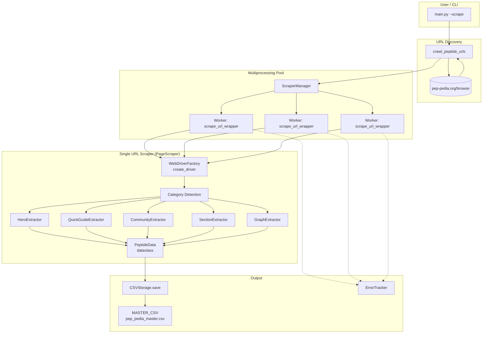
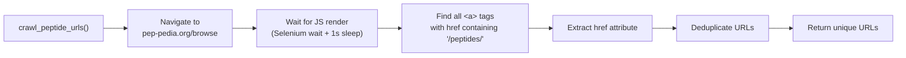
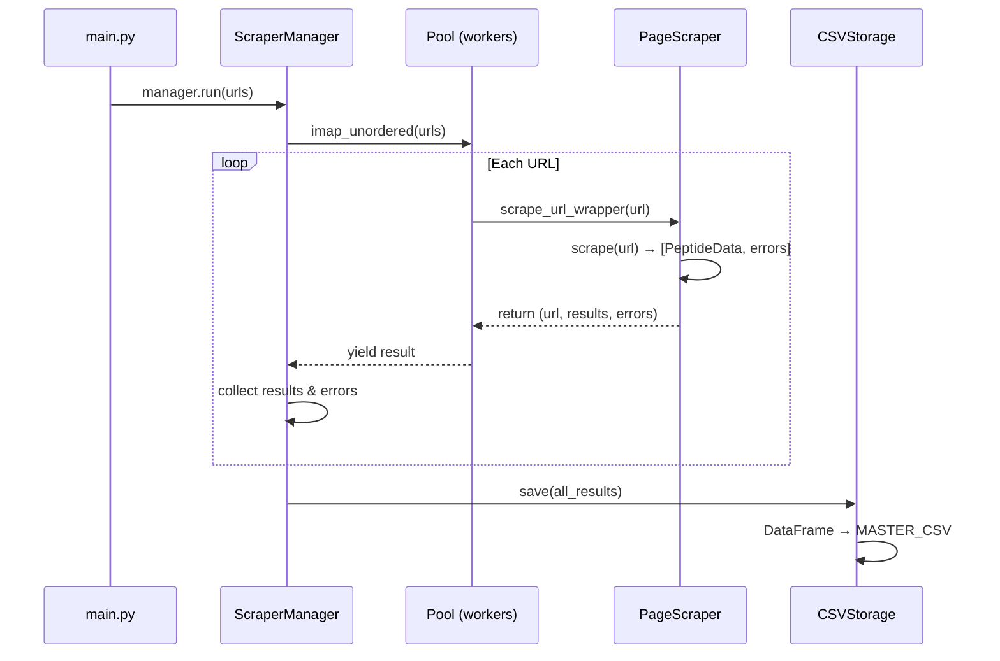
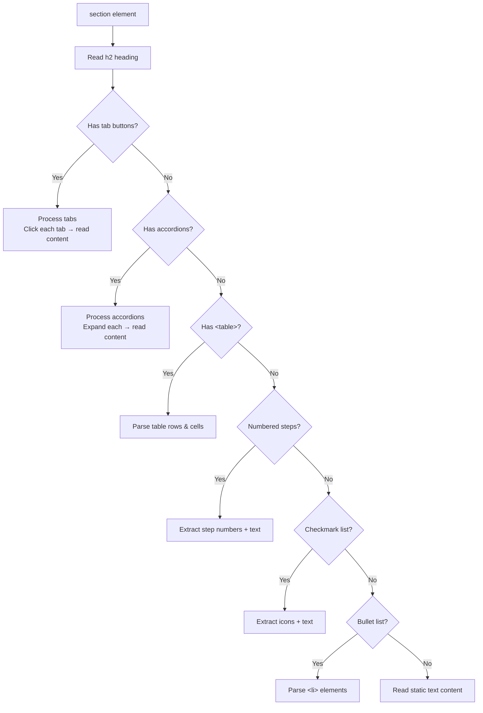
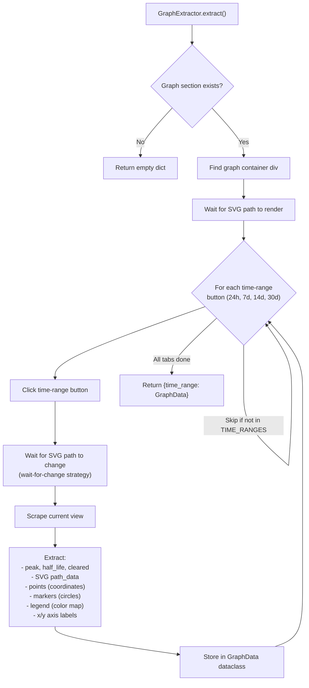

# Feature: Web Scrape

> **Module**: `src/services/`, `src/extractors/`, `src/utils/crawl_peptide_urls.py`, `src/infrastructure/webdriver_factory.py`, `src/infrastructure/csv_storage.py`
>
> **Entry Point**: `main.py --scrape` or `uv run main.py --scrape`

---

## 1. Business Logic

### 1.1 Purpose

The **Scrape** feature systematically extracts comprehensive peptide data (pharmacokinetics, structure, interactions, protocols, and graph data) from [pep-pedia.org](https://pep-pedia.org). It is the data ingestion layer of the pipeline — all downstream features (sync, evaluation, visualization) depend on the output of this feature.

### 1.2 What Problem Does It Solve?

- Manually collecting peptide data across hundreds of pages is impossible at scale.
- Each peptide page has dynamic content rendered by JavaScript (tabs, accordions, interactive graphs) — a simple HTTP GET cannot extract it.
- The data must be structured consistently (CSV) for database ingestion and downstream analysis.

### 1.3 Key Business Rules

| Rule | Description |
|------|-------------|
| **Auto-discovery** | The system automatically crawls the browse page to find all peptide links — no manual URL list required. |
| **Multi-method extraction** | Each peptide may have multiple administration methods (Injection, Nasal, Oral, Topical). Each method is processed as a separate row. |
| **Headless browser** | Selenium ChromeDriver runs in headless mode to handle JS-heavy pages. Automation fingerprints are masked to avoid bot detection. |
| **Concurrent scraping** | Multiple URLs are scraped in parallel using multiprocessing (`Pool`), limited to `min(cpu_count(), 4)` workers. |
| **Graceful error handling** | If one category or URL fails, the scraper continues with the remaining items. Errors are tracked for post-run review. |
| **Overwrite semantics** | Each scrape run overwrites the master CSV — it always represents the latest scrape result. |

---

## 2. Architecture Overview



---

## 3. Code Logic & Workflow

### 3.1 URL Discovery (`crawl_peptide_urls`)

**File**: `src/utils/crawl_peptide_urls.py`



**Pseudocode**:
```
1. Launch headless Chrome via WebDriverFactory
2. Navigate to https://pep-pedia.org/browse
3. Wait for JavaScript to render the page (presence of <a> tags)
4. Query all anchor elements with href containing '/peptides/'
5. Extract and deduplicate the href values
6. Return the unique list of peptide URLs
7. Quit the browser driver
```

### 3.2 WebDriver Factory (`WebDriverFactory`)

**File**: `src/infrastructure/webdriver_factory.py`

Creates a Selenium Chrome WebDriver with:

| Configuration | Purpose |
|---------------|---------|
| `--headless=new` | Run without visible browser window |
| `--no-sandbox` | Required in Docker/container environments |
| `--disable-dev-shm-usage` | Prevents shared memory issues in Docker |
| Custom user-agent | Spoofs a real Chrome browser to avoid detection |
| `excludeSwitches: ["enable-automation"]` | Hides automation indicators from JS |
| CDP script to override `navigator.webdriver` | Masks Selenium's automation flag |

Supports two modes:
- **Docker/server**: Uses explicit `CHROMEDRIVER_BIN` and `CHROME_BIN` env vars
- **Local**: Lets Selenium Manager auto-download the driver (Selenium 4.6+)

### 3.3 Scraper Manager (`ScraperManager`)

**File**: `src/services/scraper_manager.py`

**Business Logic**:
- Manages a multiprocessing pool to scrape URLs concurrently.
- Each URL is processed by a **worker function** (`scrape_url_wrapper`) that creates its own `PageScraper` instance.
- Uses `pool.imap_unordered()` for non-blocking iteration with cancellation support.
- Collects results from all workers and saves them to CSV in one batch.

**Workflow**:
```
1. Initialize multiprocessing Pool (max 4 processes)
2. Map URLs to worker function via imap_unordered
3. Iterate with 2-second timeout to support cancellation checks
4. Collect all PeptideData objects from workers
5. Save all results to MASTER_CSV via CSVStorage
6. Record any scrape errors in ErrorTracker
```

**Sequence Diagram**:


### 3.4 Page Scraper (`PageScraper`)

**File**: `src/services/page_scraper.py`

This is the core scraper that processes one peptide URL. It:

1. Creates a Selenium driver via `WebDriverFactory`
2. **Detects administration method categories** by finding buttons in the method selector
3. **For each category** (Injection, Nasal, Oral, etc.):
   - Clicks the category button (with active-state verification)
   - Runs all extractors on the rendered page
   - Assembles a `PeptideData` dataclass
4. Returns the list of `PeptideData` objects and any errors

### 3.5 Extractors

Each extractor is a specialized class that parses a specific section of the page. They all implement the `IExtractor` interface.

| Extractor | File | Data Extracted |
|-----------|------|----------------|
| **HeroExtractor** | `src/extractors/hero.py` | Peptide name, subtitle, hero facts (MW, formula, CAS, sequence, etc.) |
| **QuickGuideExtractor** | `src/extractors/quick_guide.py` | Quick reference data (dosage, timing, half-life) |
| **CommunityExtractor** | `src/extractors/community.py` | Community insights, poll results, user ratings |
| **SectionExtractor** | `src/extractors/section.py` | Structured content sections — handles accordions, tabs, tables, bullet lists, numbered steps, checkmark lists |
| **GraphExtractor** | `src/extractors/graph.py` | SVG path data (coordinates), markers, axis labels, legend, peak/half-life/cleared stats — for each time range (24h, 7d, 14d, 30d) |

#### BaseExtractor

**File**: `src/extractors/base.py`

Provides two shared utilities:

- **`safe_click(driver, wait, element)`**: Scrolls element into view, waits for clickability, clicks via Selenium. Falls back to JavaScript click if the normal click fails.
- **`wait_for_loading(seconds=0.3)`**: Simple sleep to allow JS animations to settle.

#### SectionExtractor — Content Type Detection

The SectionExtractor detects the content type of each `<section>` element and applies the appropriate parsing strategy:



#### GraphExtractor — Detailed Workflow

**File**: `src/extractors/graph.py`



**Key Technical Detail — Wait-for-Change Strategy**:
The graph extractor tracks the SVG `d` attribute before clicking a new tab. After clicking, it waits until the `d` attribute changes. This prevents stale data from the previous tab being captured.

### 3.6 CSV Storage (`CSVStorage`)

**File**: `src/infrastructure/csv_storage.py`

| Method | Behavior |
|--------|----------|
| `save(data)` | Converts `PeptideData` objects to a flat DataFrame. One row per peptide+method. Hero facts become columns. Graph data is JSON-serialized into a `graph_data_json` column. **Overwrites** the master CSV file. |
| `read()` | Reads the master CSV file using `csv.DictReader`. Returns a list of row dicts. |

The `save` method flattens the deeply nested `PeptideData` dataclass into a tabular structure:

```
Peptide_Name | Full_Name | Method | URL | molecular_weight | chemical_formula | ... | quick_guide_dosage | ... | graph_data_json
```

---

## 4. Error Handling

### ErrorTracker

**File**: `src/utils/error_tracker.py`

Tracks two categories of errors:

- **Scrape errors**: URL failed → recorded with `record_scrape_error(url, error, category)`
- **DB errors**: Database operation failed → recorded with `record_db_error(row_id, stage, error)`

At the end of a run, the tracker can:
- Print a summary to console
- Save a JSON report to `output/tracker_report.json`

### Error Logging

- **`error_log.txt`**: All errors with timestamps
- **`debug_log.txt`**: Detailed debug trace for troubleshooting

---

## 5. Configuration

**File**: `src/config.py`

| Setting | Default | Description |
|---------|---------|-------------|
| `TIMEOUT` | 5s | Selenium WebDriverWait timeout |
| `OUTPUT_DIR` | `output/` | Directory for CSV output |
| `MASTER_CSV` | `output/pep_pedia_master.csv` | Primary data file |
| `TIME_RANGES` | `["24h", "7d", "14d", "30d"]` | Graph time ranges to extract |
| `BUTTON_SKIP_LIST` | `["peak", "half-life", ...]` | UI buttons to skip (not time-ranges) |

---

## 6. Dependencies

| Library | Purpose |
|---------|---------|
| `selenium` | Browser automation for JS-heavy pages |
| `pandas` | DataFrame construction for CSV output |
| `tqdm` | Progress bars for CLI feedback |
| `python-dotenv` | Environment variable loading |

---

## 7. CLI Usage

```bash
# Run full pipeline (scrape + sync)
uv run main.py --scrape --sync

# Scrape only
uv run main.py --scrape

# Scrape with a limit (first N URLs)
uv run main.py --scrape --limit 5

# Scrape specific URLs instead of auto-discovery
uv run main.py --scrape --url https://pep-pedia.org/peptides/example
```
