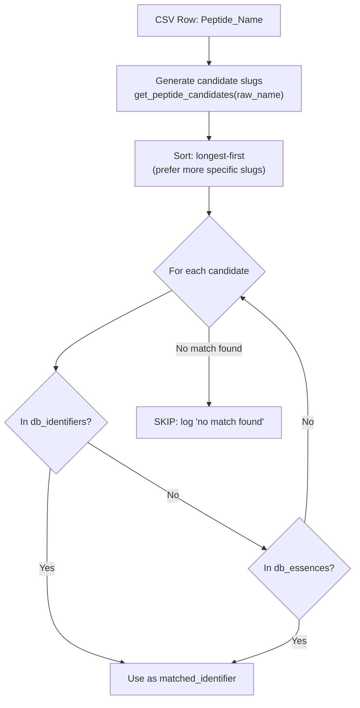
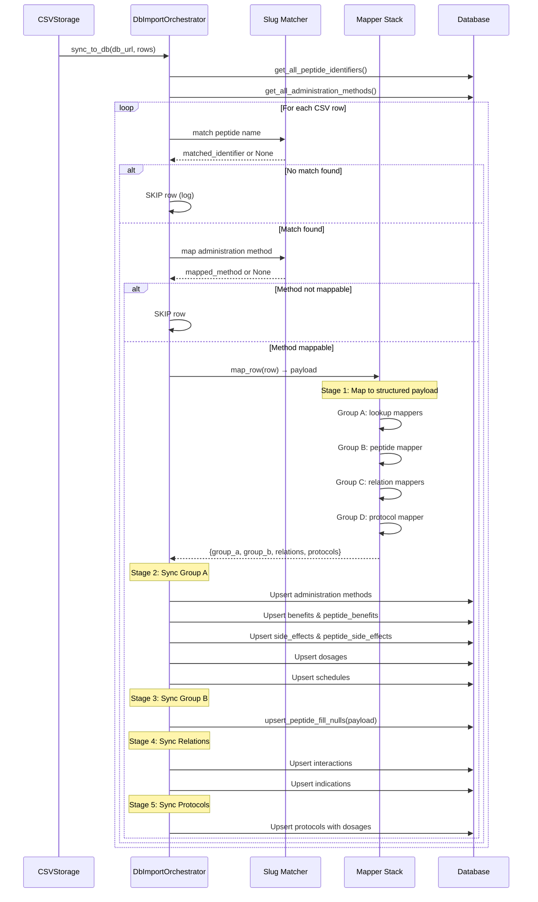
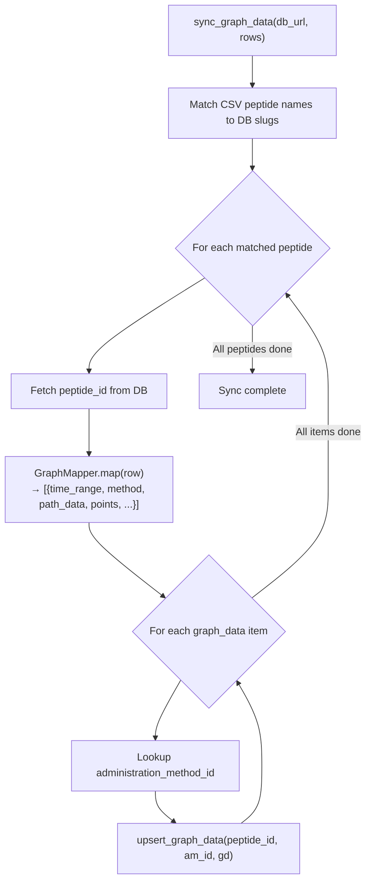

# Feature: Database Sync

> **Module**: `src/mappers/`, `src/infrastructure/db/`, `src/infrastructure/csv_storage.py`
>
> **Entry Points**: `main.py --sync` (v1 sync), API endpoints (`/api/v1/sync/*`), Scheduler (automated)
>
> **Supporting Scripts**: `sync_supabase.sh`, `migration_peptide_graph.sql`

---

## 1. Business Logic

### 1.1 Purpose

The **Sync** feature transforms the raw scraped CSV data into structured database records and persists them to PostgreSQL. It handles the entire ETL (Extract-Transform-Load) pipeline from the flat CSV file into normalized relational tables.

### 1.2 What Problem Does It Solve?

- The scraped CSV is a flat, denormalized representation — not suitable for relational queries or application use.
- Peptide data spans multiple related concepts (benefits, side effects, dosages, protocols, interactions, graph data) that need to be stored in separate normalized tables.
- Data must be **idempotent** — re-running the sync should not create duplicates (upsert semantics).
- Only peptides that already exist in the database are synced — the CSV may contain new peptides that haven't been registered yet.

### 1.3 Key Business Rules

| Rule | Description |
|------|-------------|
| **Only sync matched peptides** | The system matches CSV peptide names to existing DB slugs. Peptides not found in DB are skipped with a log entry. |
| **Method mapping** | CSV administration methods (e.g., "nasal", "injectable") are mapped to canonical DB method names (e.g., "Nasal Spray", "Injectable") via a keyword map. |
| **Grouped idempotent sync** | Data is synced in groups (A–F) with upsert logic to avoid duplicates. |
| **Two sync paths** | Core table sync (groups A–F) and Graph data sync (separate table) can run independently. |
| **Missing-only graph sync** | A variant sync that only inserts graph data for methods not yet present in DB. |

---

## 2. Architecture Overview

```mermaid
flowchart TB
    subgraph Input["Input"]
        A[MASTER_CSV<br/>pep_pedia_master.csv]
    end

    subgraph Orchestration["Orchestration Layer"]
        B[DbImportOrchestrator<br/>(Core Tables)]
        C[GraphImportOrchestrator<br/>(Graph Tables)]
    end

    subgraph Mapping["Mapper Stack"]
        direction TB
        D[Group A: Lookup Mappers]
        E[Group B: Peptide Mapper]
        F[Group C: Relation Mappers]
        G[Group D: Protocol Mapper]
        H[Group E-F: Graph Mapper]
    end

    subgraph Database["PostgreSQL Database"]
        I[(Lookup Tables<br/>benefits, side_effects,<br/>dosages, schedules,<br/>administration_methods)]
        J[(Peptides Table)]
        K[(Relation Tables<br/>interactions, indications)]
        L[(Protocols & Graph<br/>peptide_protocols,<br/>peptide_graph)]
    end

    subgraph Matching["Matching Layer"]
        M[Slug/Essence Matcher]
        N[Method Keyword Mapper]
    end

    A --> B
    A --> C
    B --> M
    B --> N
    C --> M
    M --> D & E & F & G
    N --> D & F & G
    D --> I
    E --> J
    F --> K
    G --> H
    H --> L
```

---

## 3. Code Logic & Workflow

### 3.1 Matching Layer

Before any data is synced, the system must determine whether a CSV row corresponds to an existing peptide in the database.

#### Slug/Essence Matching

**Used by**: `DbImportOrchestrator.sync_to_db()` and `GraphImportOrchestrator.sync_graph_data()`



**Key Utility — `get_peptide_candidates()`**:
Takes a raw peptide name and generates multiple slug variants. For example, `"Hexarelin (Examorelin)"` might generate candidates `["hexarelin-examorelin", "hexarelin", "examorelin"]`. Sorting longest-first ensures the most specific match wins.

#### Method Keyword Mapping

CSV raw methods → Canonical DB method names:

| CSV Keyword | DB Method Name |
|-------------|---------------|
| `nasal`, `intranasal` | Nasal Spray |
| `topical` | Topical Cream |
| `oral` | Capsule |
| `injectable` | Injectable |

If no keyword matches, or the mapped method doesn't exist in the DB's `administration_methods` table, the row is skipped.

### 3.2 Core Sync Flow (`DbImportOrchestrator`)

**File**: `src/mappers/db_import_orchestrator.py`



### 3.3 Mapper Groups

The mapper stack transforms one CSV row into structured database payloads, organized by group:

#### Group A — Lookup Mappers

**Directory**: `src/mappers/group_a/`

| Mapper | File | Output |
|--------|------|--------|
| `AdministrationMethodMapper` | `lookup_mappers.py` | `[{"name": "Injectable"}, ...]` |
| `BenefitMapper` | `lookup_mappers.py` | `[{"name": "Muscle growth", "description": "..."}, ...]` |
| `SideEffectMapper` | `lookup_mappers.py` | `[{"name": "Nausea", "severity": "mild"}, ...]` |
| `DosageMapper` | `lookup_mappers.py` | `[{"amount": "200", "unit": "mcg", "frequency": "daily"}, ...]` |
| `ScheduleMapper` | `lookup_mappers.py` | `[{"name": "2x per week", "description": "..."}, ...]` |
| `ResearchStudyMapper` | `lookup_mappers.py` | `[{"title": "...", "authors": "...", "url": "..."}, ...]` |

**Business Logic**:
- Each mapper reads the flat CSV columns relevant to its domain.
- Column names are derived from the flattened hero facts, quick guide, and section data.
- The `application_places` list is deduplicated across all protocols.

#### Group B — Peptide Mapper

**Directory**: `src/mappers/group_b/`

| Mapper | Output Fields |
|--------|---------------|
| `PeptideMapper` | `name`, `slug`, `synonyms`, `overview`, `mechanism_of_action`, `sequence`, `fda_approval_status`, `wada_status`, `cycle_duration`, `storage_temperature`, `stop_signs`, `key_information` |

**Business Logic**:
- The peptide record is **upserted** (insert or update on conflict).
- Uses `upsert_peptide_fill_nulls()` — only fills empty fields, never overwrites existing data. This preserves manually curated data.
- Detects whether the operation was an insert (new peptide) or an update (filled previously null fields).

#### Group C — Relation Mappers

**Directory**: `src/mappers/group_c/`

| Mapper | Output |
|--------|--------|
| `RelationMapper` | `interactions: [{"secondary_peptide_name": "...", "interaction_type": "synergy"}, ...]`, `indications: [{"indication_title": "...", "effectiveness_tag": "..."}, ...]` |

#### Group D — Protocol Mapper

**Directory**: `src/mappers/group_d/`

| Mapper | Output |
|--------|--------|
| `ProtocolMapper` | `[{"name": "...", "description": "...", "administration_method_id": N, "best_timing": "...", "effects_timeline": "...", "application_places": [...]}, ...]` |

### 3.4 Graph Sync Flow (`GraphImportOrchestrator`)

**File**: `src/mappers/graph_import_orchestrator.py`



#### Graph Mapper

**File**: `src/mappers/group_d/graph_mapper.py`

Handles two input formats and normalizes them for DB insertion:

| Format | Source | Key Differences |
|--------|--------|-----------------|
| **Format 1** | `src` pipeline (via `csv_storage.py` → `dataclasses.asdict()`) | Metadata at root level, labels use `"label"` key |
| **Format 2** | Graph scraper standalone JSON | Metadata nested under `"metadata"`, labels use `"text"` key |

**Normalization**: Axis labels are standardized to `{"pos": N, "label": "..."}` regardless of input format.

### 3.5 Missing-Only Graph Sync (`sync_graph_missing_data`)

A variant that:
1. Fetches existing administration methods for each peptide from DB
2. Only inserts graph data for methods **not yet present**
3. Used by the scheduler to avoid overwriting existing graph data

### 3.6 Database Layer

#### DbManager

**File**: `src/infrastructure/db/service.py`

A facade that coordinates all repositories:

```python
class DbManager:
    # Connection management
    connect() / close()
    
    # Peptide operations
    get_all_peptide_identifiers()  # Returns list of slugs
    get_peptide_by_slug(slug)      # Returns peptide dict
    upsert_peptide_fill_nulls()    # Idempotent insert/update
    
    # Lookup operations
    get_lookup_id(table, name)     # Returns ID by name
    get_all_administration_methods()
    
    # Graph operations
    get_methods_for_peptide(peptide_id)
    upsert_graph_data(peptide_id, am_id, graph_data)
```

#### Repository Pattern

**File**: `src/infrastructure/db/repositories/`

Separate repository classes for each domain:

| Repository | Table(s) |
|------------|----------|
| `PeptideRepository` | `peptides` |
| `ProtocolRepository` | `peptide_protocols`, `protocol_dosages` |
| `GraphRepository` | `peptide_graph` |
| `InteractionRepository` | `peptide_interactions` |
| `IndicationRepository` | `peptide_research_indications` |
| `LookupRepository` | `administration_methods`, `benefits`, `side_effects`, `dosages`, `schedules` |
| `ReferenceRepository` | `peptide_references` |

---

## 4. Supabase Sync Script

**File**: `sync_supabase.sh`

A shell script for migrating data between two Supabase PostgreSQL databases:

```bash
./sync_supabase.sh <source_pooling_url> <target_pooling_url>
```

**Workflow**:
```
1. pg_dump the source database (with --clean --if-exists flags)
2. psql restore to the target database
3. Optional: clean up the dump file
```

Flags used:
- `--clean`: DROP existing objects before recreating
- `--no-owner`, `--no-privileges`: Avoid role/permission errors common with Supabase
- `--quote-all-identifiers`: Handle case-sensitive object names

---

## 5. Error Handling

| Scenario | Handling |
|----------|----------|
| CSV row doesn't match any DB peptide | Skip with debug log |
| Administration method unmappable | Skip (counted as skipped) |
| Stage 1 (mapping) fails | Record DB error in tracker, continue to next row |
| Stage 2 (lookup upsert) fails | Record error, continue |
| Stage 3 (peptide upsert) fails | Record error, continue |
| Graph data parsing fails | Skip graph data for that row |
| Database connection lost | Exception propagates up — handled by caller |

---

## 6. Database Schema Highlights

Key tables involved in sync:

```
peptides
  ├── id (PK), name, slug, overview, mechanism_of_action, ...

administration_methods       peptide_administration_methods (if used)
benefits                     peptide_benefits
side_effects                 peptide_side_effects
dosages                      protocol_dosages
schedules                    (linked via protocol_dosages)

peptide_protocols
  ├── id (PK), peptide_id (FK), administration_method_id (FK), name, ...

peptide_interactions
  ├── peptide_id_1 (FK), peptide_name_2, interaction_type, ...

peptide_research_indications
  ├── peptide_id (FK), indication_title, effectiveness_tag, ...

peptide_graph
  ├── peptide_id (FK), administration_method_id (FK), time_range,
  ├── path_data (TEXT), points (JSONB), markers (JSONB), ...
```

---

## 7. CLI Usage

```bash
# Run sync only (reads existing CSV)
uv run main.py --sync

# Sync with row limit
uv run main.py --sync --limit 10

# Full pipeline (scrape + sync)
uv run main.py --scrape --sync

# Sync via API (see FastAPI feature doc)
# POST /api/v1/sync/core
# POST /api/v1/sync/graph
```
