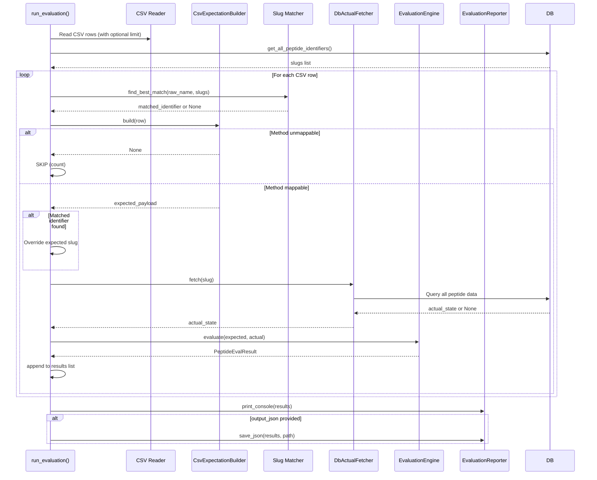
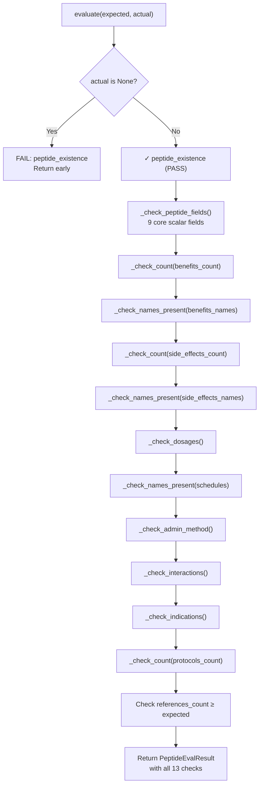
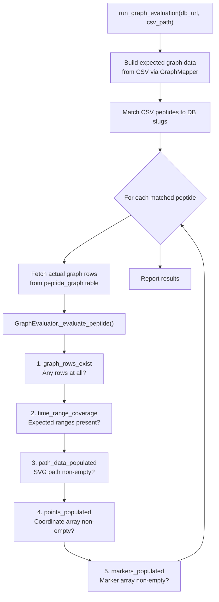

# Feature: Evaluation

> **Module**: `src/evaluation/`
>
> **Entry Points**: `main.py --evaluate`, API endpoints (`/api/v1/evaluation/core`, `/api/v1/evaluation/graph`)

---

## 1. Business Logic

### 1.1 Purpose

The **Evaluation** feature measures how accurately the scraped CSV data was synchronized to the database. It compares the **expected** database state (derived from the CSV) against the **actual** database state and produces a structured report highlighting discrepancies.

### 1.2 What Problem Does It Solve?

- After syncing CSV data to the database, there's no guarantee that every field was correctly transferred.
- Some data may be skipped due to matching failures, type mismatches, or database constraints.
- Developers and clients need a quantitative measure of "sync quality" — how much of the source data made it into the DB correctly.
- Graph data (SVG paths, coordinates) has different quality dimensions than tabular data and needs separate evaluation.

### 1.3 Key Business Rules

| Rule | Description |
|------|-------------|
| **Same-mapper comparison** | The evaluation reuses the exact same mapper stack as the sync pipeline to derive "expected" data — ensuring an apples-to-apples comparison. |
| **Per-peptide results** | Each peptide gets its own evaluation result with individual check outcomes. |
| **Four status levels** | `PASS` (correct), `FAIL` (missing/wrong), `WARN` (partial), `SKIP` (no data expected) |
| **Early exit on missing peptide** | If a peptide doesn't exist in the DB at all, remaining checks are skipped — one clear failure. |
| **Separate graph evaluation** | Graph data (pharmacokinetics curves) is evaluated independently with 5 dedicated checks. |
| **JSON & console reports** | Results are printed to console with color-coded output and can be saved as JSON for CI/CD integration. |

---

## 2. Architecture Overview

```mermaid
flowchart TB
    subgraph Inputs["Inputs"]
        A[MASTER_CSV]
        B[(PostgreSQL Database)]
    end

    subgraph CoreEval["Core Evaluation Pipeline"]
        C[CsvExpectationBuilder]
        D[DbActualFetcher]
        E[EvaluationEngine]
        F[EvaluationReporter]
    end

    subgraph GraphEval["Graph Evaluation Pipeline"]
        G[GraphMapper<br/>(from CSV)]
        H[DB Graph Fetcher]
        I[GraphEvaluator]
    end

    subgraph Outputs["Outputs"]
        J[Console Report<br/>color-coded per peptide]
        K[JSON Report File]
    end

    A --> C
    B --> D
    C --> E
    D --> E
    E --> F
    F --> J
    F --> K

    A --> G
    B --> H
    G --> I
    H --> I
    I --> F
```

---

## 3. Code Logic & Workflow

### 3.1 Evaluation Runner (`run_evaluation`)

**File**: `src/evaluation/runner.py`



### 3.2 CsvExpectationBuilder

**File**: `src/evaluation/csv_expectation_builder.py`

**Business Logic**: Reuses the exact same `DbImportOrchestrator` mapper stack to derive what **should** be in the database from the CSV row.

```python
# It mirrors the sync pipeline's logic exactly:
class CsvExpectationBuilder:
    def build(self, row) -> dict | None:
        # 1. Resolve administration method (same keyword map as sync)
        # 2. If unmappable → return None (orchestrator would skip this row)
        # 3. Patch the row's Method with the canonical name
        # 4. Run DbImportOrchestrator.map_row(patched_row)
        # 5. Run GraphMapper.map(patched_row) for graph data
        # 6. Return unified expected payload
```

**Returned payload structure**:
```python
{
    "peptide_name": str,
    "slug": str,
    "administration_method": str,
    "peptide": { ... },           # Group B fields
    "benefits": [...],            # Group A
    "side_effects": [...],
    "dosages": [...],
    "schedules": [...],
    "references": [...],
    "interactions": [...],        # Group C
    "indications": [...],
    "protocols": [...],           # Group D
    "graph_data": [...],          # Graph mapper
}
```

### 3.3 DbActualFetcher

**File**: `src/evaluation/db_actual_fetcher.py`

**Business Logic**: Queries the live database for the **actual** state of a peptide. The returned structure mirrors the expected payload shape so the evaluation engine can do a direct comparison.

**Database queries executed per peptide**:

| Query | Table | Returns |
|-------|-------|---------|
| 1 | `peptides` | Core fields (name, slug, overview, mechanism_of_action, ...) |
| 2 | `benefits` + `peptide_benefits` | Benefit names |
| 3 | `side_effects` + `peptide_side_effects` | Side effect names |
| 4 | `dosages` + `protocol_dosages` + `peptide_protocols` | Dosage amounts & units |
| 5 | `schedules` + `protocol_dosages` + `peptide_protocols` | Schedule names |
| 6 | `administration_methods` + `peptide_protocols` | Method names |
| 7 | `peptide_interactions` | Interaction details |
| 8 | `peptide_research_indications` | Indication details |
| 9 | `peptide_protocols` | Protocol details |
| 10 | `peptide_references` | Reference count |

Total: **10 queries per evaluated peptide**.

### 3.4 EvaluationEngine

**File**: `src/evaluation/evaluation_engine.py`

**Business Logic**: Compares expected vs actual and produces structured `CheckResult` objects.

#### 13 Core Checks Per Peptide

| # | Check Name | What It Validates | Status Logic |
|---|------------|-------------------|--------------|
| 1 | **peptide_existence** | Peptide row exists in `peptides` table | FAIL if actual is None → early return |
| 2 | **peptide_fields** | 9 core scalar fields match CSV | PASS if all present, FAIL if any missing |
| 3 | **benefits_count** | Number of benefits | PASS if DB ≥ CSV, WARN if partial, FAIL if 0 |
| 4 | **benefits_names** | Benefit names are present | FAIL if expected names not in DB |
| 5 | **side_effects_count** | Number of side effects | Same as benefits count |
| 6 | **side_effects_names** | Side effect names are present | Same as benefits names |
| 7 | **dosages** | Dosage count | PASS if DB ≥ expected, WARN if fewer |
| 8 | **schedules** | Schedule names | Checks names present; WARN if CSV has none expected |
| 9 | **administration_method** | Method linked via protocols | PASS if expected method is in DB list |
| 10 | **interactions** | Interaction details | FAIL if any expected interaction missing; handles type remapping |
| 11 | **indications** | Indication titles | PASS if all titles found in DB |
| 12 | **protocols_count** | Number of protocols | PASS if DB ≥ CSV |
| 13 | **references_count** | Reference count | PASS if DB ≥ CSV, WARN if some, FAIL if 0 |



#### CheckResult Dataclass

```python
@dataclass
class CheckResult:
    name: str
    status: str     # "PASS" | "FAIL" | "WARN" | "SKIP"
    expected: Any   # What the CSV says should be there
    actual: Any     # What the DB actually has
    detail: str     # Human-readable explanation
```

#### PeptideEvalResult Dataclass

```python
@dataclass
class PeptideEvalResult:
    peptide_name: str
    slug: str
    administration_method: str
    checks: List[CheckResult]

    # Computed properties
    passed   → bool (all checks PASS/WARN/SKIP)
    fail_count → int
    pass_count → int
    total      → int
```

### 3.5 GraphEvaluator

**File**: `src/evaluation/graph_evaluator.py`

A **separate evaluation pipeline** for pharmacokinetics graph data stored in the `peptide_graph` table.



**5 Graph-Specific Checks**:

| # | Check Name | What It Validates |
|---|------------|-------------------|
| 1 | **graph_rows_exist** | At least one row exists in `peptide_graph` for this peptide |
| 2 | **time_range_coverage** | All expected time ranges (24h, 7d, 14d, 30d) are present |
| 3 | **path_data_populated** | The SVG `path_data` field is non-empty |
| 4 | **points_populated** | The `points` JSON array has at least one entry |
| 5 | **markers_populated** | The `markers` JSON array has at least one entry |

### 3.6 EvaluationReporter

**File**: `src/evaluation/reporter.py`

**Business Logic**: Renders results in two formats:

#### Console Output (color-coded)

```
━━━━━━━━━━━━━━━━━━━━━━━━━━━━━━━━━━━━━━━━━━━━━━━━━━━━
 AOD-9604 [Injectable]  ✗ 1 FAILED  (12/13 checks)
━━━━━━━━━━━━━━━━━━━━━━━━━━━━━━━━━━━━━━━━━━━━━━━━━━━━
  ✓ peptide_existence               actual=found
  ✓ peptide_fields                  actual=9 OK
  ✓ benefits_count                  actual=3
  ✓ benefits_names                  actual=3
  ✗ dosages                         expected=4  actual=2
                                     → DB has 2 dosage(s), expected 4...
  ✓ schedules                       actual=2
  ... (remaining checks)
```

#### JSON Output

```json
[
  {
    "peptide_name": "AOD-9604",
    "slug": "aod-9604",
    "administration_method": "Injectable",
    "passed": false,
    "pass_count": 12,
    "fail_count": 1,
    "total_checks": 13,
    "checks": [
      {"name": "dosages", "status": "FAIL", "expected": 4, "actual": 2, "detail": "..."},
      ...
    ]
  }
]
```

---

## 4. API Endpoints

### Core Evaluation

```
POST /api/v1/evaluation/core
Body: { "limit": 10, "output_json": "/path/to/report.json" }
Response: { "job_id": "...", "status": "pending", ... }
```

### Graph Evaluation

```
POST /api/v1/evaluation/graph
Body: { "limit": 10, "output_json": "/path/to/graph_report.json" }
Response: { "job_id": "...", "status": "pending", ... }
```

Both endpoints are **asynchronous** — they create a job, start it in the background, and return a `job_id` immediately. Progress can be tracked via:

```
GET /api/v1/operations/job/{job_id}
```

---

## 5. CLI Usage

```bash
# Run evaluation on all CSV rows
uv run main.py --evaluate

# Evaluate with limit
uv run main.py --evaluate --limit 20

# Evaluate and save JSON report
uv run main.py --evaluate --eval-output /path/to/report.json

# Combined: scrape + sync + evaluate
uv run main.py --scrape --sync --evaluate
```

---

## 6. Error Handling

| Scenario | Handling |
|----------|----------|
| CSV file not found | Print error, return early |
| Database URL not set | Print error, return early |
| No peptides matched | Empty results list, message printed |
| Database connection failure | Exception propagates to the API layer |
| Graph data parsing error | Individual peptide skipped, continues |
| Slug mismatch | Fetcher returns None → peptide_existence FAIL |

---

## 7. Key Design Decisions

1. **Reusing the mapper stack**: The evaluation doesn't re-parse the CSV. It runs the exact same mappers as the sync, ensuring the comparison is valid.

2. **13 separate checks instead of one**: Granular checks let users see exactly what failed — a peptide might have all benefits but missing dosages.

3. **WARN for partial data**: Some data may be valid but incomplete (e.g., DB has 3 of 5 expected dosages). WARN highlights these without marking as hard failure.

4. **Graph evaluation is separate**: Graph data (SVG paths, coordinates) has different quality characteristics than structured text data. A separate evaluator with 5 tailored checks handles this.

5. **Asynchronous API**: Evaluation can take minutes for hundreds of peptides. The job queue pattern prevents HTTP timeouts.
