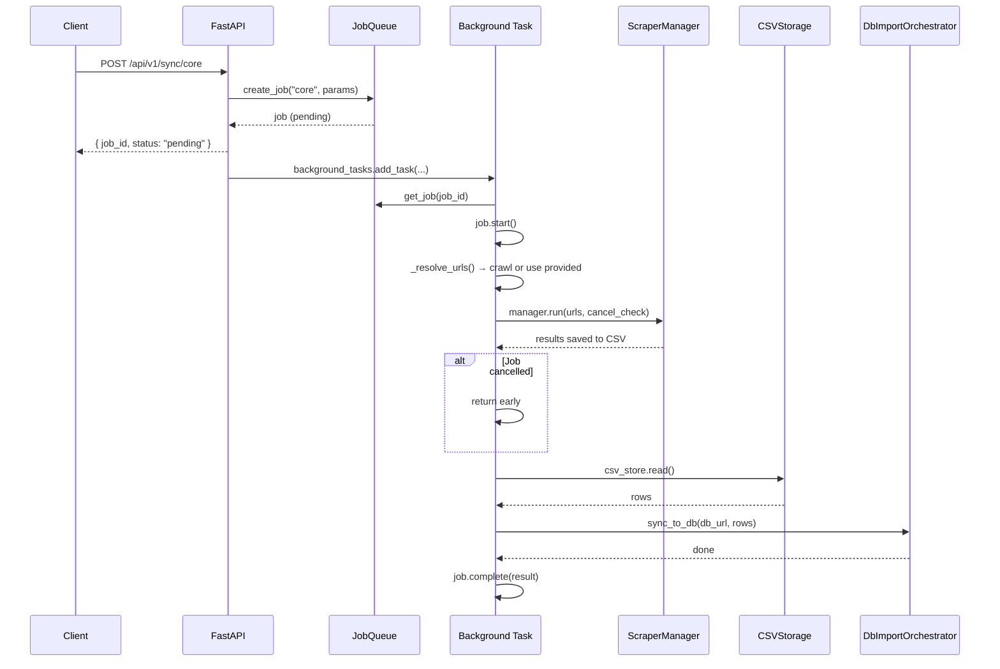
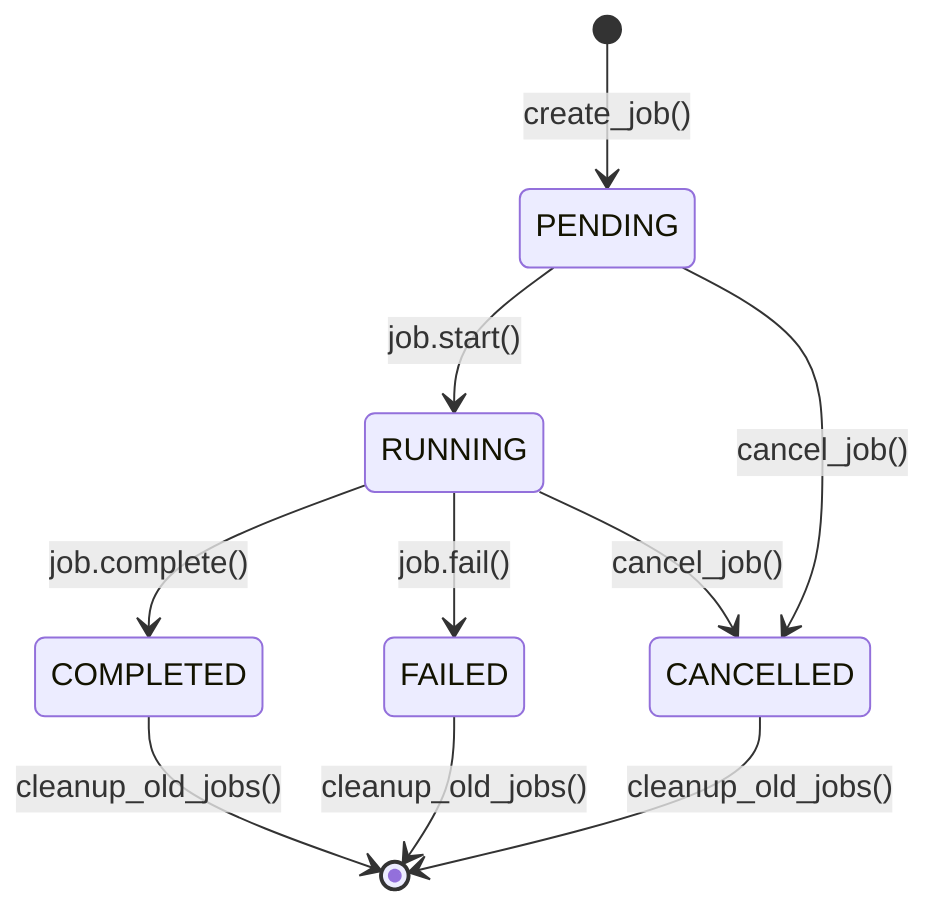
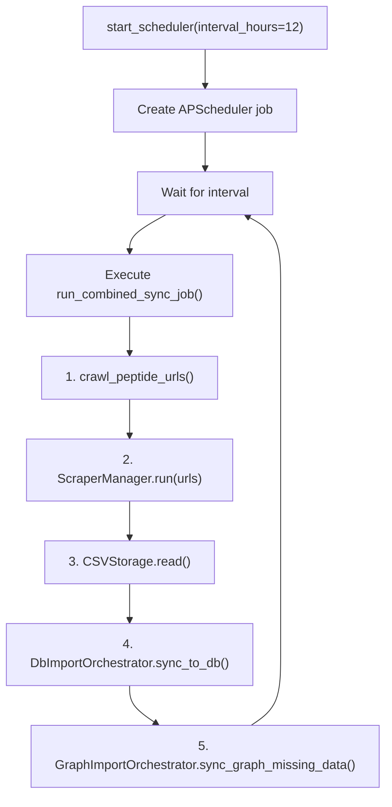

# Feature: FastAPI Server, Scheduler & Operations

> **Module**: `api_server.py`, `viz_server.py`, `src/api/`, `src/core/scheduler.py`, `src/core/job_queue.py`
>
> **Entry Point**: `uv run api_server.py`

---

## 1. Business Logic

### 1.1 Purpose

The **FastAPI Server** provides a REST API for the entire peptide pipeline — triggering syncs, running evaluations, querying graph data, and managing background jobs. The **Scheduler** enables fully automated periodic syncs. The **Operations** layer provides job tracking and system health monitoring.

### 1.2 What Problem Does It Solve?

- The CLI (`main.py`) is useful for one-off operations, but production systems need HTTP APIs for integration.
- Long-running operations (scraping hundreds of URLs, syncing to DB) must run asynchronously without blocking the HTTP request.
- Users need to track progress of background operations, cancel stuck jobs, and monitor system health.
- Automated periodic syncs ensure the database stays up-to-date without manual intervention.
- The visualization dashboard requires a live data API to fetch graph coordinates and peptide lists.

### 1.3 Key Business Rules

| Rule | Description |
|------|-------------|
| **Async job pattern** | All long-running operations return immediately with a `job_id`. Progress is polled via separate endpoints. |
| **In-memory job queue** | Jobs are stored in memory (not persisted). Jobs are lost on server restart. |
| **Connection pooling** | Database connections are pooled (`minconn=1, maxconn=5`) for efficient concurrent access. |
| **Background scheduler** | APScheduler runs sync jobs on a configurable interval (default 12h). |
| **Cancellable jobs** | Running jobs can be cancelled; the scraper pool respects cancellation by checking status between iterations. |
| **CORS-enabled** | Cross-origin requests are supported for the web visualization dashboard. |
| **Idempotent sync endpoints** | Re-triggering a sync is safe — upsert logic prevents duplicates. |

---

## 2. Architecture Overview

```mermaid
flowchart TB
    subgraph Clients["Clients"]
        A[Browser / Dashboard]
        B[curl / HTTP Client]
        C[CLI]
    end

    subgraph FastAPI["FastAPI Server (api_server.py)"]
        D["/" Home page]
        E["/api/v1/sync/*" Sync endpoints]
        F["/api/v1/evaluation/*" Evaluation endpoints]
        G["/api/v1/operations/*" Job & Health endpoints]
        H["/api/v1/graph/*" Graph data endpoints]
        I["/visualization" Static dashboard]
    end

    subgraph Core["Core Services"]
        J[Scheduler<br/>(APScheduler)]
        K[JobQueue<br/>(In-memory)]
    end

    subgraph Workers["Background Workers"]
        L[ScraperManager<br/>(multiprocessing)]
        M[DbImportOrchestrator<br/>(Core Sync)]
        N[GraphImportOrchestrator<br/>(Graph Sync)]
        O[Evaluation Runner]
    end

    subgraph Storage["Storage"]
        P[(PostgreSQL DB)]
        Q[MASTER_CSV]
    end

    A --> D & I
    B --> E & F & G & H
    C --> J
    J --> L & M & N
    E --> K
    F --> K
    G --> K
    E --> L --> Q
    E --> M --> P
    E --> N --> P
    F --> O --> P
    H --> P
```

---

## 3. Code Logic & Workflow

### 3.1 Server Initialization & Lifespan

**File**: `api_server.py`

```python
@asynccontextmanager
async def lifespan(app: FastAPI):
    # On startup:
    get_pool()          # Warm up DB connection pool
    start_scheduler()   # Start APScheduler
    yield
    # On shutdown:
    shutdown_scheduler()  # Gracefully stop scheduler
    _pool.close()         # Close all DB connections
```

The server has two build variants:

| Server | File | Purpose |
|--------|------|---------|
| **`api_server.py`** | Standalone consolidated server | Full API + visualization (primary) |
| **`viz_server.py`** | Visualization-only server | Lightweight graph dashboard only |

### 3.2 API Endpoints Reference

#### Sync Endpoints (`/api/v1/sync/`)

**File**: `src/api/v1/endpoints/sync.py`

| Method | Endpoint | Description | Background Task |
|--------|----------|-------------|-----------------|
| `POST` | `/core` | Scrape → Core DB sync | `run_core_sync_task()` |
| `POST` | `/graph` | Scrape → Graph DB sync | `run_graph_sync_task()` |
| `POST` | `/graph-missing` | Scrape → Graph sync (missing only) | `run_graph_sync_missing_task()` |

**Request Body** (`SyncRequest`):
```json
{
  "limit": 10,
  "urls": ["https://pep-pedia.org/peptides/example"]
}
```
- `urls`: If null or empty, auto-discovers URLs via crawling.
- `limit`: Caps the number of URLs processed.

**Sync Workflow** (for `/core`):


#### Evaluation Endpoints (`/api/v1/evaluation/`)

**File**: `src/api/v1/endpoints/evaluation.py`

| Method | Endpoint | Description |
|--------|----------|-------------|
| `POST` | `/core` | Run core evaluation (13 checks per peptide) |
| `POST` | `/graph` | Run graph evaluation (5 checks per peptide) |

**Request Body**:
```json
{
  "limit": null,
  "output_json": "/app/output/eval_report.json"
}
```

#### Graph Data Endpoints (`/api/v1/graph/`)

**File**: `src/api/v1/endpoints/graph.py`

| Method | Endpoint | Description |
|--------|----------|-------------|
| `GET` | `/peptides` | List all peptides with graph data |
| `GET` | `/peptide/{id}/methods` | List administration methods for a peptide |
| `GET` | `/graph/{id}` | Get graph data by peptide ID + method query param |

**Graph Data Response**:
```json
GET /api/v1/graph/42?method=Injectable
{
  "peptide_name": "AOD-9604",
  "administration_method": "Injectable",
  "24h": {
    "peak": "48 min",
    "half_life": "8 hrs",
    "cleared": "~1.7 days",
    "path_data": "M 10 35 C ...",
    "points": [{"x": 10.0, "y": 35.0}],
    "markers": [{"cx": 41.82, "cy": 20.60, "r": 0.7, "fill": "#f59e0b"}],
    "legend": {"peak": "rgb(34, 197, 94)", "half-life": "rgb(245, 158, 11)"},
    "x_axis_labels": [{"pos": 10.0, "label": "Dose"}],
    "y_axis_labels": [{"pos": 8.0, "label": "100%"}]
  },
  "7d": { ... },
  "14d": { ... },
  "30d": { ... }
}
```

#### Operations Endpoints (`/api/v1/operations/`)

**File**: `src/api/v1/endpoints/operations.py`

| Method | Endpoint | Description |
|--------|----------|-------------|
| `GET` | `/jobs` | List all jobs (optional `?status=` filter) |
| `GET` | `/job/{id}` | Get detailed status of a specific job |
| `DELETE` | `/job/{id}` | Cancel a running/pending job |
| `GET` | `/health` | System health + job queue statistics |

**Job Status Flow**:


**Job Response Format**:
```json
GET /api/v1/operations/job/sync_core_1687765432_a1b2c3d4
{
  "job_id": "sync_core_1687765432_a1b2c3d4",
  "status": "running",
  "endpoint": "/sync/core",
  "parameters": {"limit": null, "urls": null},
  "created_at": "2025-06-26T10:00:00",
  "start_time": "2025-06-26T10:00:01",
  "end_time": null,
  "result": null,
  "error": null,
  "progress": 45
}
```

### 3.3 Scheduler

**File**: `src/core/scheduler.py`

Uses **APScheduler** (`AsyncIOScheduler`) to run automated syncs.



**Scheduler API**:

| Function | Description |
|----------|-------------|
| `start_scheduler(interval_hours, interval_minutes, limit)` | Start or update the scheduler |
| `pause_scheduler()` | Pause without removing the job |
| `resume_scheduler()` | Resume paused job |
| `get_scheduler_status()` | Get current interval, next run time, status |
| `shutdown_scheduler()` | Stop scheduler completely |

**Scheduler Status Response**:
```json
{
  "status": "running",
  "interval_hours": 12,
  "interval_minutes": 0,
  "limit": null,
  "next_run_time": "2025-06-27T00:00:00"
}
```

### 3.4 Job Queue

**File**: `src/core/job_queue.py`

A lightweight **in-memory** job tracking system.

```python
class Job:
    job_id: str          # Unique ID (endpoint + timestamp + uuid)
    endpoint: str        # Which endpoint created this job
    status: JobStatus    # pending → running → completed/failed/cancelled
    progress: int        # 0-100
    result: Any          # Final result payload
    error: str           # Error message if failed
```

**Key Methods**:

| Method | Description |
|--------|-------------|
| `create_job(endpoint, params)` | Create new job with unique ID |
| `get_job(job_id)` | Retrieve job by ID |
| `list_jobs(status=None)` | List all jobs, optionally filtered |
| `cancel_job(job_id)` | Cancel if pending or running |
| `cleanup_old_jobs(hours=24)` | Remove completed/failed jobs older than N hours |

**Limitation**: Jobs are NOT persisted — restarting the server clears all job history.

### 3.5 Connection Pool

**File**: `src/infrastructure/db/connection.py` → `DbPool`

```python
_pool: DbPool = DbPool(db_url, minconn=1, maxconn=5)
```

**Behavior**:
- Maintains 1-5 persistent database connections.
- `acquire()` context manager checks out a connection and returns it on exit.
- No new TCP connections per request — improves performance.
- Pool is created lazily on first request (warmed up on server start).
- All connections are closed on server shutdown.

### 3.6 Visualization Dashboard

**File**: `src/visualization/` (index.html, script.js, styles.css)

The FastAPI server mounts a static file server for the frontend:

```python
app.mount("/visualization", StaticFiles(directory=visualization_path, html=True), name="visualization")
```

**Dashboard Features**:
- Dropdown selector for peptide and administration method
- Renders pharmacokinetics curves (SVG paths) for each time range
- Displays peak, half-life, and clearance markers
- Color-coded legend for graph elements

---

## 4. Router Registration

**File**: `src/api/v1/routers.py`

```python
api_router = APIRouter()
api_router.include_router(sync.router,        prefix="/sync",        tags=["Syncing"])
api_router.include_router(evaluation.router,  prefix="/evaluation",  tags=["Evaluation"])
api_router.include_router(graph.router,                            tags=["Graph"])
api_router.include_router(operations.router,  prefix="/operations", tags=["Operations"])
```

Final URL structure:

```
/
/api/v1/sync/core
/api/v1/sync/graph
/api/v1/sync/graph-missing
/api/v1/evaluation/core
/api/v1/evaluation/graph
/api/v1/graph/peptides
/api/v1/graph/peptide/{id}/methods
/api/v1/graph/graph/{id}?method=
/api/v1/operations/jobs
/api/v1/operations/job/{id}
/api/v1/operations/health
/visualization/
/docs                (Swagger UI, auto-generated)
```

---

## 5. Docker Deployment

**Dockerfile**: Multi-stage build with Chromium for Selenium.

```dockerfile
FROM python:3.12-slim-bookworm
RUN apt-get install -y chromium chromium-driver
COPY requirements.txt . && pip install -r requirements.txt
COPY src/ ./src/
ENV CHROME_BIN=/usr/bin/chromium
ENV CHROMEDRIVER_BIN=/usr/bin/chromedriver
CMD ["uvicorn", "api_server:app", "--host", "0.0.0.0", "--port", "8000"]
```

**docker-compose.yml**:

```yaml
services:
  postgres:    # PostgreSQL 17, port 15432
  scraper:     # Python app with Chromium, 2GB shared memory
```

---

## 6. Error Handling

| Scenario | HTTP Status | Response |
|----------|-------------|----------|
| Database URL not configured | 500 | `{"detail": "DATABASE_URL not configured."}` |
| Job not found | 404 | `{"detail": "Job {id} not found"}` |
| Cancel non-runnable job | 400 | `{"detail": "Cannot cancel job in completed status"}` |
| Invalid job status filter | 400 | `{"detail": "Invalid status. Must be one of: ..."}` |
| Graph data not found | 404 | `{"detail": "No graph data found for peptide {id}"}` |
| General server error | 500 | Error detail propagated |

---

## 7. CLI Usage

```bash
# Start the consolidated API server
uv run api_server.py

# Start visualization-only server
uv run viz_server.py

# Both servers run on http://localhost:8000 by default
# API docs available at http://localhost:8000/docs
```

---

## 8. Configuration

| Setting | Default | Source | Description |
|---------|---------|--------|-------------|
| `DATABASE_URL` | — | `.env` | PostgreSQL connection string |
| Server host | `0.0.0.0` | Hardcoded | Bind address |
| Server port | `8000` | Hardcoded | HTTP port |
| Pool minconn | `1` | Hardcoded | Minimum DB connections |
| Pool maxconn | `5` | Hardcoded | Maximum DB connections |
| Scheduler interval | `12h` / `0m` | `start_scheduler()` | Automated sync interval |
